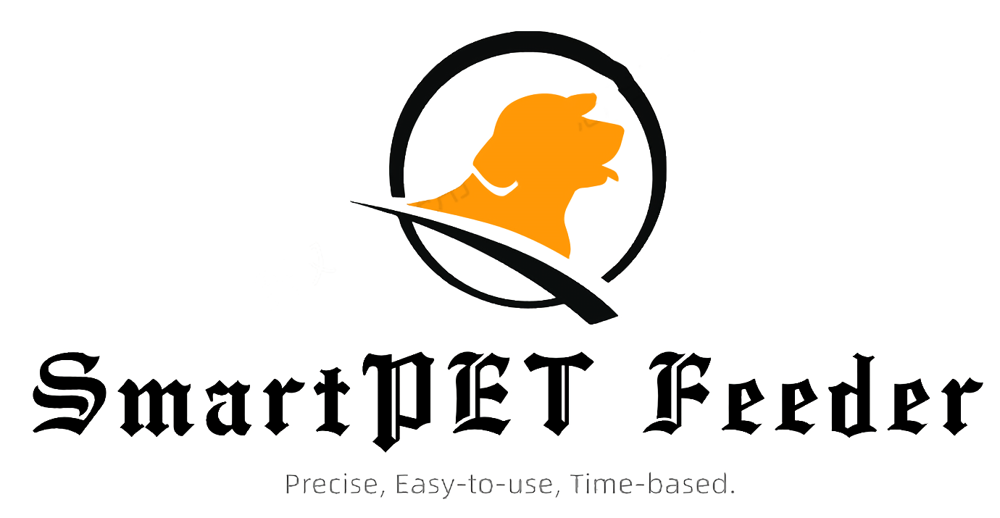

# SmartPET Feeder

The open-source, easy-to-use feeder

## Installation:

### Requirements:
#### For Raspberry Pi:
+ A Raspberry Pi with Raspberry Pi OS (of course).
+ A touchscreen
+ A outer shell (recommanded because the pet may break the machine.)
#### For Espressif ESP32:
+ A Expressif ESP32 module (of course).
#### For Other Hardware:
+ A stepper motor that is fit the size of moter in 3D model and a A4988 stepper motor driver.
+ You need 3D-print or some way to make the feeder hardware (the .obj 3D file is in `hardware` directory).
+ Some wires and power supply.
### Install:
#### For Raspberry Pi:
+ Just use `bash raspberry_pi/install.sh`, and it will automatic install.
#### For Espressif ESP32:
+ Please use PlatformIO to open the project and just upload it.

### Usage
#### Quick Start
+ To use, run the start.sh file in the desktop and it will automatic run. 

#### Model Training
+ You may train your own model because the motor was diffrenet. Before training, please look at the comments in `other/train.py` and follow the instruction of the comment. And you need to run `python other/train.py`.
+ You must convert .h5 hdf5 format to the .tflite tensorflow lite format and replace `raspberry_pi/src/model.tflite` to your model.

#### ESP32 Use
+ You can use it by write s{your rounds}; to the serial.

#### Web API Use
+ Feed: POST /api/food JSON input: {"weight": $your feeding weight}
+ Add plan: POST /api/plan JSON input: {
                                       "time_h": $hour,
                                       "time_m": $minutes,
                                       "weight": $weight
                                       }
+ Delete plan: DELETE /api/plan JSON input:{
                                           "time_h": $hour,
                                           "time_m": $minutes,
                                           }
## Contributing:

Open a pull request is welcome for us. But if you want to make bug fixes or major changes such as a new function, etc., please create an issue first.

## License

This project was licensed under GPL v3.0 license. For more detail, please look at the LICENSE file.